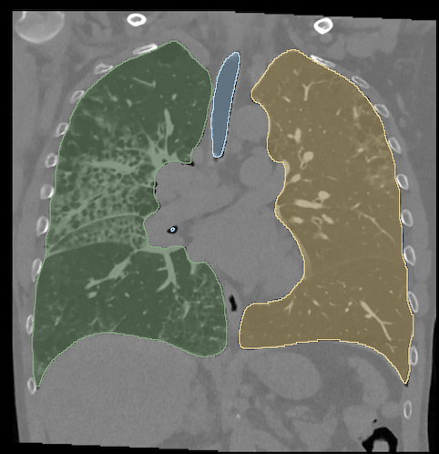
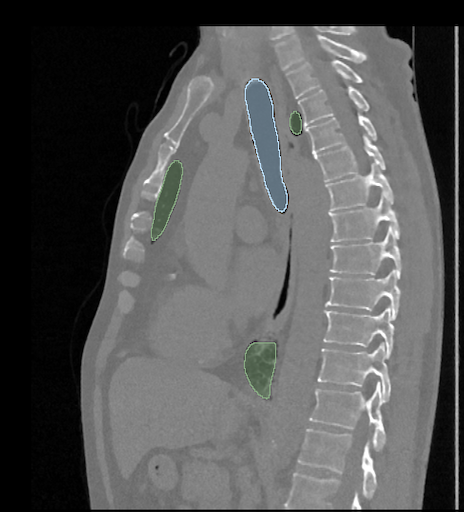

This project aims to use 2 X-ray images to create an artificial 3D scan of the lungs. The benefits of this strategy would be: 
- Increased access to 3D medical images as X-rays are cheaper and more common than CT scan devices.
- Patient receives less radiation compared to classical CT scans. 

The data sets used in this project are: 
- https://www.kaggle.com/code/muhakabartay/osic-pulmonary-fibrosis-eda-dicom-full
- https://dataverse.harvard.edu/dataset.xhtml?persistentId=doi:10.7910/DVN/6ACUZJ

The recreation is done using an autoencoder mapping the biplanar X-rays to the 3D point cloud that has either been segmented using the file dcm_prep.py or with the software "3D Slicer".
  
